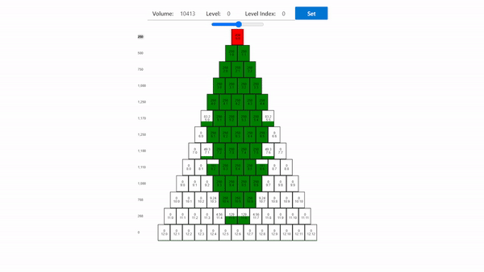
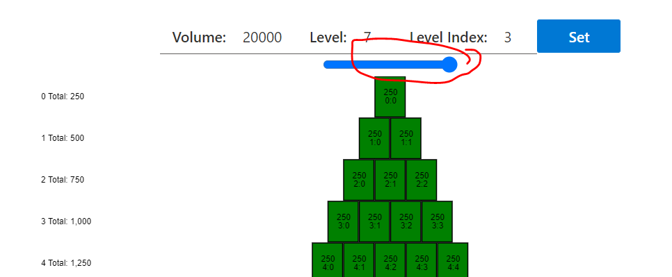
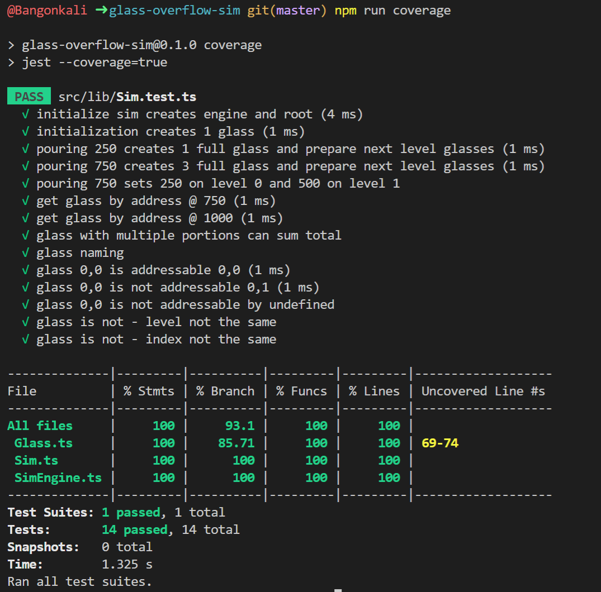

# Glass Overflow Sim



This project was bootstrapped with [Create React App](https://github.com/facebook/create-react-app).

## How to use?

1. Go to [`https://glass-overflow-sim.regalado.com.ph/`](https://glass-overflow-sim.regalado.com.ph/)

1. Input the desired **Volume of Water**. The **Level (`i`)** and **Level Index (`j`)** and click on Set.

1. The diagram should show the fill level of all glasses as long as the parameters are within the limitations of the program.

## Assumptions & Constraints

### Performance Limitation

The limit for the Volume is 20,000. Selecting high numbers near the limit takes time for the current implementation of the algorithm. So on high numbers this will have slow response unfortunately. It also depends on the computer being used. Maybe there is a better algorithm that scales well, but not this. The limit for addressing with `i` and `j` are `2` digit numbers.



The solution is not optimized for mobile use.

## High Level Dev Notes

Only 3 files are really used for the simulation. 

1. `./lib/Glass.ts` - Used to represent the entity of a Glass of Water.
1. `./lib/SimEngine.ts`- Used to represent the simulation engine.
1. `./lib/Sim.ts` - Just a simple Bootsrapping Code.

The rest are relevent to studying implementation ofa visualisation which I also find is a fun activity.

1. `./components/GlassWidget.ts` - Used to layout in the UI a Glass of Water.
1. `./components/SimWidget.ts` - Used to layout the entire simulation canvas.
1. `./pages/HomePage.ts` - Contains all controls to set parameters for the simulation.

I also tried working with storybook which is a fun way of previewing components.

1. `./stories/*/**` - Contains storybook related content.

## Available Scripts

In the project directory, you can run:

### Development Preview

```bash
npm run start
```

### Run Test & Coverage

```bash
npm run coverage
```

A directory called coverage will be created if you run this command. The file `coverage\lcov-report\index.html` will show a good HTML report on the status of the test coverage. Due to personal contraints there are no UI Tests for this application at the moment.



### Build

```bash
npm run build
```

## CI/CD

The DevOps solution is stored here: [`.github\workflows\build.yaml`](https://github.com/bangonkali/glass-overflow-sim/blob/master/.github/workflows/build.yaml). It is deployed to cloudflare pages upon every push if the Build is successful.