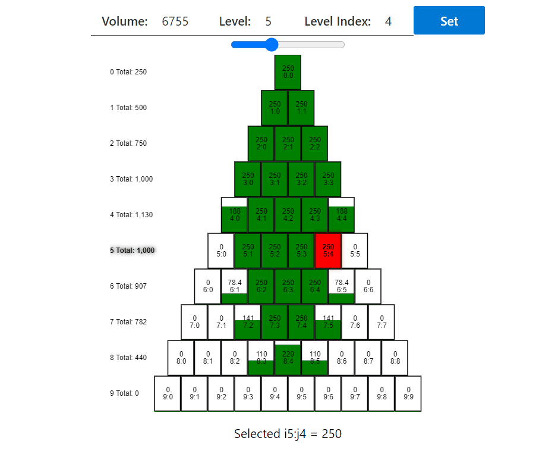
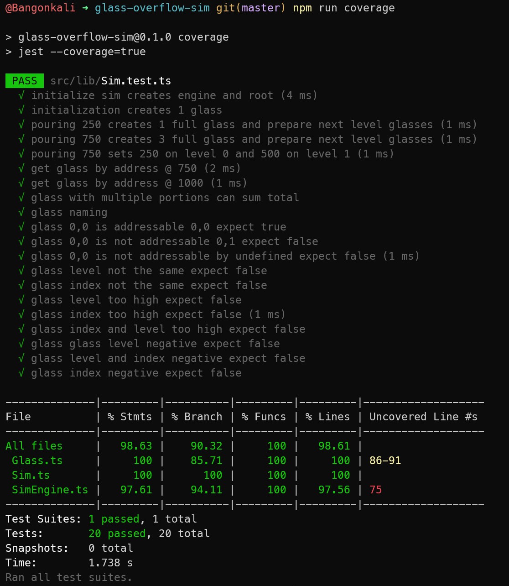

# Glass Overflow Sim



This project was bootstrapped with [Create React App](https://github.com/facebook/create-react-app).

## Available Scripts

In the project directory, you can run:

### Development Preview

```bash
npm run start
```

### Run Test Coverage

```bash
npm run coverage
```



### Build

```bash
npm run build
```
